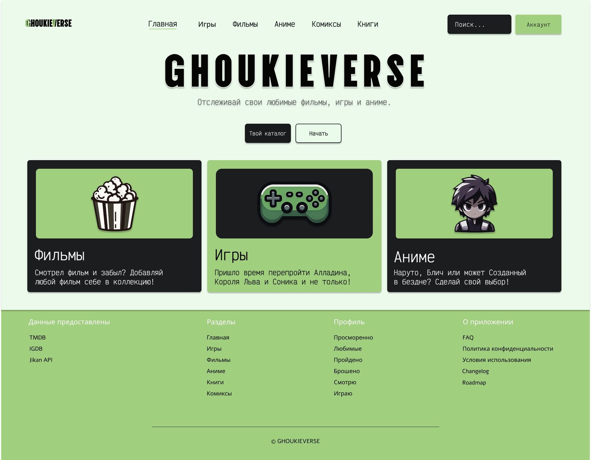
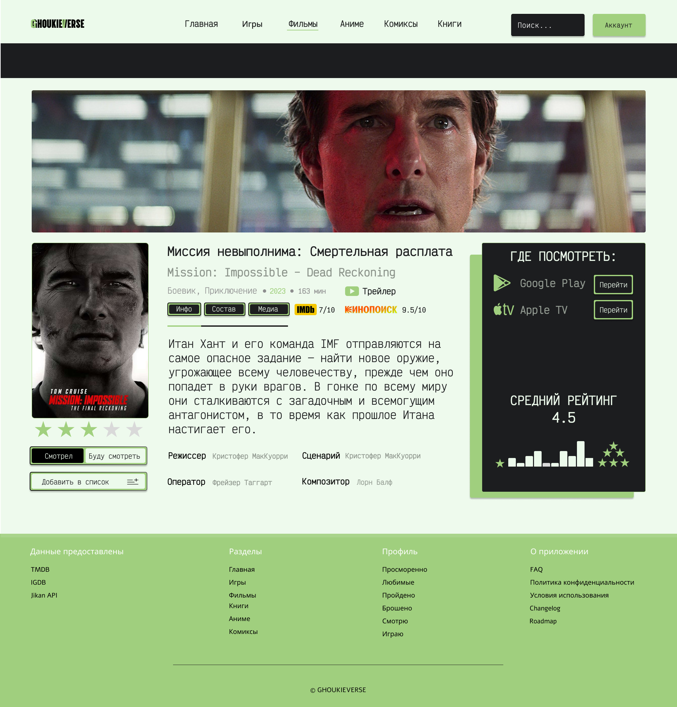
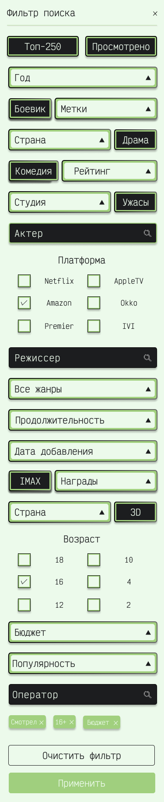
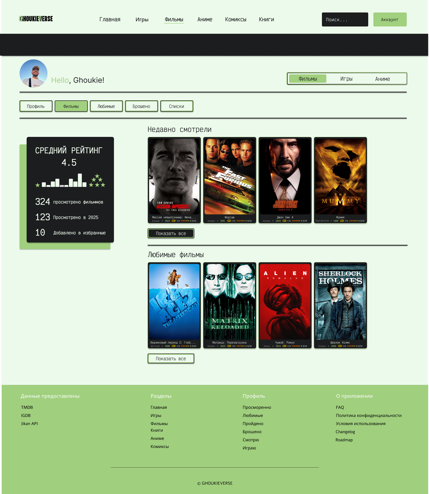

  

*Где всё, что ты смотришь, играешь и читаешь — в одном месте.*

---

## 📌 О проекте

На данный момент **реализован только функционал фильмов**, включая:
- Главную страницу и навигацию
- Раздел с фильмами (поиск, фильтр, карточки)
- Детали фильма
- Профиль пользователя
- Адаптивный мобильный фильтр

Все остальные разделы (**игры, аниме, книги, комиксы**) находятся на этапе **UX/UI-проектирования** в Figma.  
Этот README демонстрирует **не только текущую реализацию, но и видение проекта в целом**.

---

## 🖼️ Скриншоты

> Реализованные страницы

  
*Главная страница — навигация и превью разделов.*

  
*Страница со списком фильмов и фильтром.*

  
*Страница фильма: описание, оценка, детали и медиа.*

  
*Фильтр для мобильных устройств — адаптивный и удобный.*

  
*Страница профиля: статистика, просмотренные фильмы, избранные и добавленные.*

---

## 🛠️ Технологии

- **Frontend**: Next.js 15.2 (App Router)
- **Стили**: Tailwind CSS + кастомные компоненты
- **Язык**: TypeScript
- **State Management**: Redux Toolkit + Next-Redux-Wrapper
- **UI-иконки**: Lucide React, Heroicons, React Icons
- **Анимации**: Framer Motion
- **API-клиенты**:
    - TMDB (The Movie Database)
    - Kinopoisk DEV
    - IGDB 
    - Jikan API 
- **Утилиты**: Lodash.debounce, clsx, class-variance-authority, tailwind-merge
- **Текстовые эффекты**: Tailwind CSS Text Shadow, Text Stroke
- **Дизайн**: Figma (полная дизайн-система в разработке)
- **Хостинг**: Vercel
- **Сборка**: Next.js Export (статический экспорт)